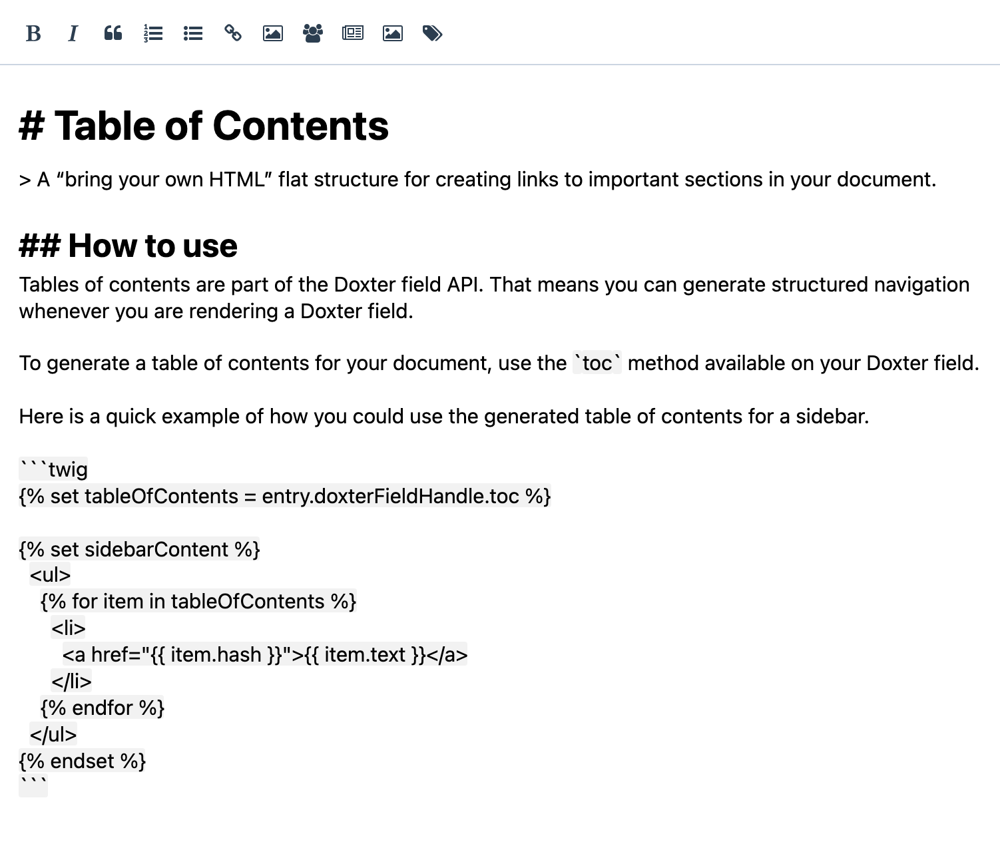

<!-- feature-intro -->
Doxter combines a focused Markdown field with a capable parser for Craft templates. Authors get a live editing experience while developers keep dependable, extensible control over how Markdown becomes HTML.
<!-- feature-intro-end -->

<!-- feature-section media-size="medium" -->
## A better Markdown field

Give authors a dedicated field for GitHub-flavoured Markdown, with a familiar formatting toolbar and Live Preview support. Developers retain predictable source content and dependable control over its rendered output.

<!-- feature-section-end -->

<!-- feature-grid -->
- :icon[link] **Linkable headings** Generate named anchors for sections in longer documents.
- :icon[brackets-contain] **Shortcodes** Introduce reusable project components without putting HTML in the field.
- :icon[plug-connected] **Parsing events** Extend or adjust output through an event-driven developer API.
- :icon[list-tree] **Table of contents** Turn document headings into structured navigation ready for a sidebar or on-page index.
- :icon[typography] **Typography helpers** Convert quotes, dashes, ellipses and spacing into more polished typographic output.
- :icon[refresh] **Reference tags** Resolve links to Craft elements before Markdown is rendered so changed slugs do not leave stale URLs behind.
<!-- feature-grid-end -->
